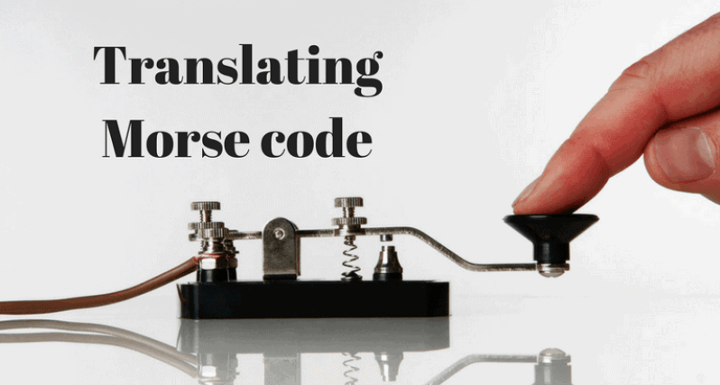

##  MORSE CODE TRANSLATOR USING PYTHON

   

The simple program takes input from the User to translate text -> Morse code & Morse code -> txt.

****

### REQUIREMENTS :

- python 3

****
### Encryption :

In the case of encryption, we extract each character (if not space) from a word one at a time and match it with its corresponding morse code stored in whichever data structure we have chosen(if you are coding in python, dictionaries can turn out to be very useful in this case)
Store the morse code in a variable that will contain our encoded string and then we add a space to our string that will contain the result.
While encoding in morse code we need to add 1 space between every character and 2 consecutive spaces between every word.
If the character is a space then add another space to the variable containing the result. We repeat this process till we traverse the whole string

***
### Decryption :
In the case of decryption, we start by adding a space at the end of the string to be decoded (this will be explained later).
Now we keep extracting characters from the string till we are not getting any space.
As soon as we get a space we look up the corresponding English language character to the extracted sequence of characters (or our morse code) and add it to a variable that will store the result.
Remember keeping track of the space is the most important part of this decryption process. As soon as we get 2 consecutive spaces we will add another space to our variable containing the decoded string.
The last space at the end of the string will help us identify the last sequence of morse code characters (since space acts as a check for extracting characters and start decoding them).

***
### Implementation :

Implementation done by Using dictionary data structure.saving the morse code chart in a dictionary where (key-value pairs) => (English Characters-Morse Code). The plaintext (English characters) takes the place of keys and the ciphertext (Morse code) forms the values of the corresponding keys. The values of keys can be accessed from the dictionary in the same way we access the values of an array through their index and vice versa..

